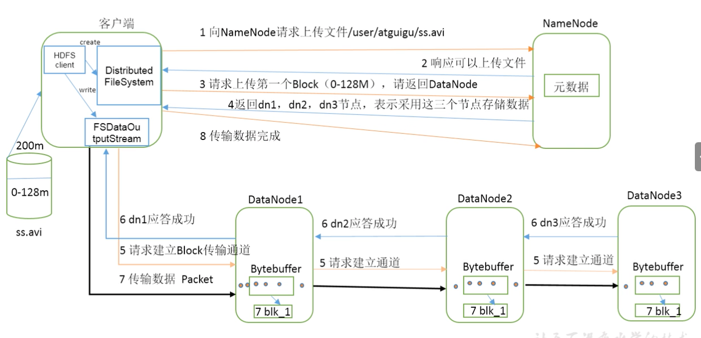
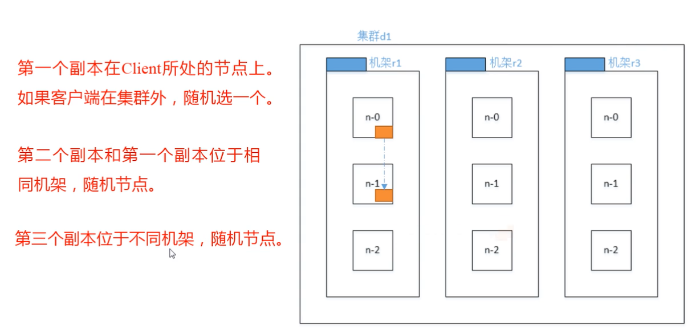
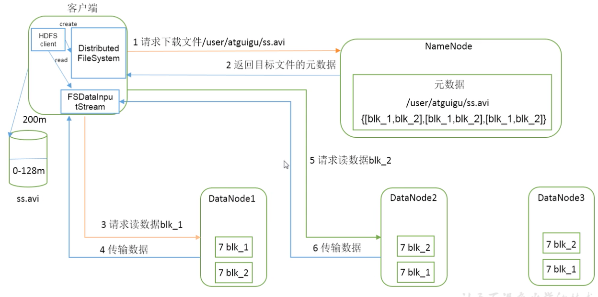
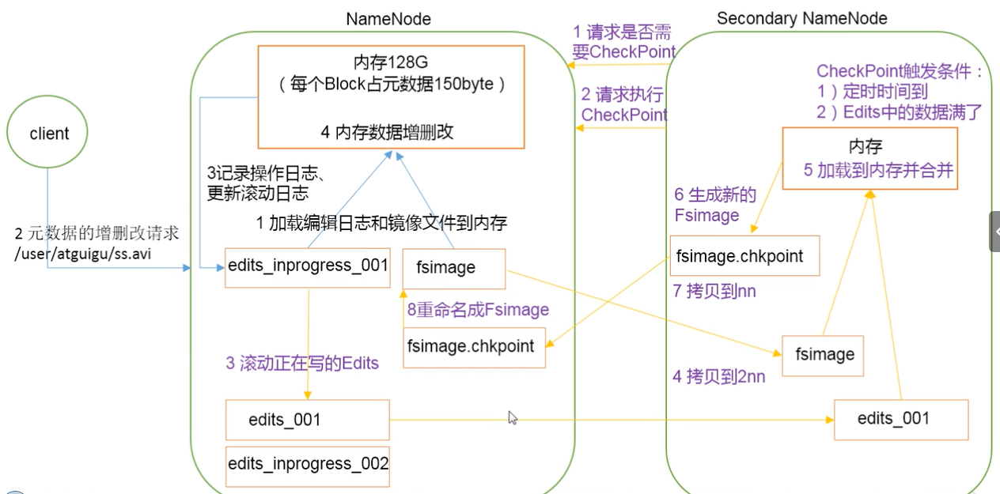
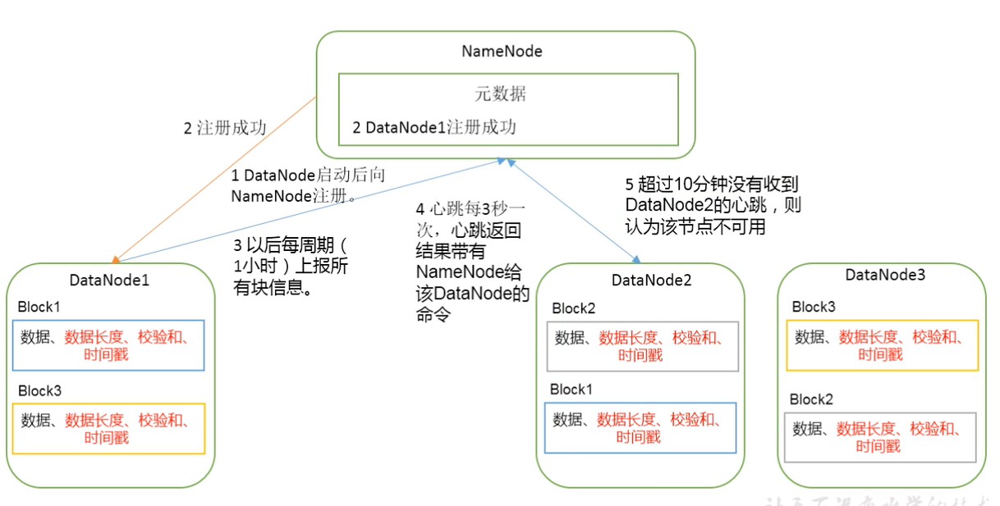

# HDFS 概述
1. 背景 在一个操作系统下存储不了所有数据,那么就分配到更多的操作系统中的磁盘,但不方便维护管理,迫切需要一种系统来管理多台机器上的文件,这就是分布式式
文件管理系统,HDFS只是分布式文件管理系统中的一种.

2. Hadoop Distributed File System 它是一个文件系统,用于存储文件,通过目录树来定位文件,其次它是分布式的,由很多服务器来实现其功能,集群中的服务器有各息的角色

3. 使用场景:适合一次写入,多次读出场景,且不支持文件修改,适合做数据分析不适合做网盘

# HDFS 优缺点
1. 优点 
    1) 高容错性 - 数据自动保存我个副本,它通过增加副本的形式,提高容错性. 某一个副本丢失后,它可以自动恢复
    2) 适合处理大数据 - 数据规模:能够处理数据规模达到GB,TB 甚至PB级别的数据;
    3) 文件规模 - 能哆处理百万规模以上的文件数量
    4) 可以构建在廉价的机器上,通过多副本机制,提高可靠性
2. 缺点
    1) 不适合低延时数据访问,比如毫秒级的存储数据,是做不到的
    2) 无法高效的对大量小文件进行存储
        存储大量小文件的话,它会占用NameNode大量的内存来存储文件目录和块信息.这样不可取,因为NameNode的内存总是有限的
        小文件存储的寻址会起过读取时间,它违反了HDFS的设计目标
    3) 不支持并发写入,文件随机修改
        一个文件只能有一个写,不允许多个线程同时写
        仅支持文件Append(追加),不支持文件的随机修改

# HDFS 组成架构
    1) NameNode(MN) 就是Master,它是一个管理者
        管理HDFS的名称空间
        配置副本策略
        管理数据块(Block)映射信息
        处理客户端读取请求
    2) DataNode 就是Slave, NameNode下达命令,DataNode执行实际操作.
        存储实际的数据块
        执行数据块的读/写操作
        
    3) Client 就是客户端
        文件切分,文件上传HDFS的时候,Client将文件切分成一个个的Block,然后进行上传
        与NameNode交互,获取文件的位置信息
        与DataNode交互,读取或者写入数据
        Client提供一些命令来管理HDFS,比如NameNode格式化
        Client可能通过一些命令来访问HDFS,比如对HDFS增加删除文件操作
    4) SecondaryNameNode 并非NameNode的热备,当NameNode挂掉的时候,它并不能马上替换NameNode提供服务
        辅助NameNode,分担其工作量,比如定期合并Fsimage和Edits,并推送级NameNode
        在紧急情况下,可辅助恢复NameNode
    
# HDFS 文件块大小
HDFS的文件在物理上是分块存储的(Block),块的大小可以通过配置参数(dfs.blocksize)来规定,默认大小在Hadoop 2.x版本中是128MB,老版本是64MB 

HDFS块的大小是由硬盘的 读取速度决定,如果 是SSD 可以设置为256MB 如果是 Raid 可以更高
Tips:
    1) HDFS的块设置太小,会增加寻址时间,程序一直在找块的开始位置
    2) 如果块设置的太大,从磁盘传输数据的时间会明显大于定位这个块开始位置所需要的时间,导致程序在处理这块数据时会非常慢.
总之:HDFS块的大小设置主要取决于硬盘传输速率

# HDFS 的Shell操作
1. 基本语法
    bib/hadoop fs 具体命令 OR bin/hdfs dfs 具体命令
    命令大全 bib/hadoop fs
    hadoop fs -help
    帮助命令 [root@hadoop221 ~]# hadoop fs -help rm
    列出文件 [root@hadoop221 ~]# hadoop fs -ls /    
    列出文件 [root@hadoop221 ~]# hadoop fs -lrs / 
    创建目录 hadoop fs -mkdir -p /huangg/huangg
    从本地剪切粘贴到HDFS hadoop fs -moveFromLocal xx.txt /huangg/huagg/ # 地址会删除
    追加一个文件到已经存在的文件末尾 hadoop fs -appendToFile xx1.txt /huangg/huangg/xx.txt
    查看文件内容
    hadoop fs -cat /huangg/huagg/test.txt

    修改文件所有者权限[-chgrp  -chmod  -chown]
    hadoop fs -chgrp huangg /huangg/t1.txt

    从本地文件系统中拷贝文件到HDFS
    hadoop fs -copyFromLocal local.txt /huangg/huangg/t2.txt

    从HDFS中拷贝文件到本地文件系统
    Hadoop fs -copyToLocal /huangg/huangg/t2.txt local.txt

    从HDFS中拷贝文件到HDFS的其它位置
    hadoop fs -cp /huangg/huangg/t2.txt /huangg/liu/t2.txt

    从HDFS中剪切文件到HDFS的其它位置
    hadoop fs -mv /huangg/huangg/t2.txt /huangg/liu/t2.txt

    从HDFS中下载文件到本地文件系统
    Hadoop fs -get /huangg/huangg/t2.txt local.txt

    从HDFS中合并下载文件到本地文件系统
    Hadoop fs -getmerge /huangg/huangg/* merge.txt

    从本地文件系统上传文件到HDFS
    Hadoop fs -put local.txt /huangg/huangg/t2.txt

    显示文件的末尾
    Hadoop fs -tail /huangg/huangg/t2.txt

    删除文件或文件夹
    Hadoop fs -rm /huangg/huangg/t2.txt
    Hadoop fs -rm -R /huangg/huangg/t2.txt

    删除空目录
    Hadoop fs -rmdir /huangg/huangg

    统计文件夹大小信息
    Hadoop fs -du -h -s /huangg/huangg
2. 设置HDFS中文件的副本数量
    hadoop fs -setrep 3 /huangg/huangg/t2.txt
    设置的副本只是记录在NameNode的元数据中,是否真的会有这么多副本,需要看DataNode的数量,因为目录只有3个DataNode最多也只会存储3份,当再增加DataNode后会自动拷贝一份副本在新的节点 直接满足副本的数量为止.

3. HDFS客户端操作

4. 参数优先级
    1） 客户端代码设置的值
    2） ClassPath下的用户自定义配置文件
    3） 然后是服务器的默认配置

5. HDFS的I/O流操作
    我们可以采用IO流的方式来实现数据的上传和下载

## HDFS的数据流
1. HDFS 写数据流程

2. 网络拓扑-节点距离计算
    在HDFS写数据的过程中，NameNode会选择距离待上传数据最近距离的DataNode接收数据
    节点距离：两个节点到达最近的共同祖先节点的距离总和

3. 副本存储节点选择（机架感知）
    1）官方IP地址
    2）副本节点选择

4. HDFS的读取数据流程

5. NameNode和SecondaryNameNode
   NameNode数据存储位置：
   在磁盘中备份元数据FsImage
    Edits文件（只进行追加操作，效率很高），每当元数据有更新或添加元数据时，修改内存中的元数据并追加到Edits中
    Edits文件 过大，效率降低，一旦断电，恢复元数据需要的时间过长
    引入一个新的节点SecondaryNamenode专门用于合并 Edits 和FsImage

    1）Fsimage - 在data/tmp/dfs/name/current 目录下查看
        hdfs oiv -p XML -i fsimage_xxxx -o fsimage.xml # 转为XML文件
    2）Edits - 在data/tmp/dfs/name/current 目录下查看
        hdfs oev -p XML -i edits_xxxxxx -o edits.xml # 转为XML文件
    NameNode被格式化后，会在data/tmp/dfs/name/current目录中产生如下文件
    fsimage_00000
    fsimage_00000.md5
    see_txid
    VERSION
    Fsimage文件：HDFS文件系统元数据的一个永久的检查点，其中包含HDFS文件系统的所有目录和文件idnode的序列化信息
    Edits文件：存放HDFS文件系统的所有更新操作的路径，文件系统客户端执行的所有写操作首先会被记录在Edits文件中
    seen_txid文件保存是一个数字，就是最后一个Edits的数字
    每次NameNode启动的时候都会装Fsimage文件读入到内存，加载Edits里面的更新操作，保证内存中的元数据是最新的，同步的

    ！！ Fsimage中没有记录块所对应的DataNode
    在集群启动后，要求DataNode上报数据块信息，并间隔一段时间后再次上报。
    3）CheckPoint时间设置
     hdfs-default.xml 通常情况下，SecondaryNameNode每隔1小时执行一次
     1 分钟检查一下操作次数，当操作次数达到100W时，SecondaryNameNode执行一次（可以配制）

6. NameNode故障恢复
    方法一：将SecondaryNameNode中的数据拷贝到NameNode存储数据的目录
    1. kill -9 NameNode进程
    2. 删除NameNode存储的数据(data/tmp/dfs/name)
    3. 拷贝SecondaryNameNode中数据到原NameNode存储目录
    4. 生启NameNode （单独启动NameNode）
   
    方法二、 使用-importCheckpoint 选项启动NameNode守护进程，从而将SecondaryNameNode中数据拷贝到NameNode目录中
    1. 修改hdfs-site.xml 中的 dfs.namenode.checkpoint.period 
    2. kill -9  NameNode进程
    3. 删除NameNode存储的数据(data/tmp/dfs/name)
    4. 如果SecondaryNameNode不和NameNode在一个主机节点上，需要将SecondaryNameNode存储数据的目录拷贝到NameNode存储数据的平级目录，并删除in_use.lock文件
    5. 导入检查点数据（等一会儿ctrl + c 结束掉）
    6. 启动NameNode

# 集群安全模式
1. NameNode启动，先装镜像文件Fsimage载入内存，并执行编辑日志Edits中的各项操作，一旦在内存中成功建立文件系统元数据的映像时，则创建一个新的Fsimage文件和一个空的编辑日志。此时NameNode开始监听DataNode请求。这个过程期间，NameNode一真运行在安全模式，即NameNode的文件系统对于客户端来说是只读的。
2. DataNode启动 系统中rover块的位置并不是由NameNode维护的，而是以块列表的形式存储在DataNode中，在xitogn的正常操作期间，NameNode会在内存中保留所有位置的映射信息。在安全模式下，各个DataNode会向NameNode发送最新的块列表信息，NameNode了解到足够多的块位置信息这后，即可高效运行文件系统。
3. 安全模式的退出判断
    如果满足最小副本条件，NameNode会在30秒钟这后就退出安全模式。在整个系统中99%的块满足最小副本值（默认1）
    在启动一个刚刚格式化的HDFS集群时，因为系统中还没有任何块，所以NameNode不会进入安全模式

4. 基本语法
    集群处理安全模式，不能执行重要操作（写操作）。集群启动完成后，自动退出安全模式
    hdfs dfsadmin -safemode get  # 查看安全模式状态
    hdfs dfsadmin -safemode enter # 进入安全模式
    hdfs dfsadmin -safemode leave # 离开安全模式
    hdfs dfsadmin -safemode wait # 等待安全模式状态

# NameNode多目录配制
1. NameNode的本地目录可以配置成多个，且每个目录存放的内容相同，增加了可靠性
2. 配置hdfs-site.xml 文件 增加如下
    dfs.namenode.name.dir下的value值 使用逗号格开 file://${hadop.tmp.dir}/dfs/name1,file://${hadop.tmp.dir}/dfs/name2
3. 同步配置 删除data,log中所有数据 格式化集群 重启集群

# DataNode工作机制
1. 一个数据块在DataNode上以文件形式存储在磁盘上，包括2个文件，一个是数据本身，一个是元数据包括数据块的长度，块数据的校验和，以及时间戳
2. DataNode启动后向NameNode注册，通过后，周期性（1小时）的向NameNode上报所有块信息
3. 心跳每3秒一次，心跳返回结果带有NameNode给DataNode的命令如复制块数据到另一台机器，或删除某个数据块。如果超过10分钟没有收到某个DataNode的心跳，则认为节点不可用
4. 集群运行中可以安全加入和退出一些机器

## 数据的完整性
### DataNode节点保证数据完整性的方法：
1. 当DataNode读取Block的时候，它会计算CheckSum
2. 如果计算扣的CheckSum，与Block创建时值不一样，说明Block已经损坏
3. Client读取其他DataNode上的Block
4. DataNode在其文件创建后周期验证CheckSum

### DataNode掉线时限参数设置
1. DataNode 进程死亡或者网络故障造成DataNode无法与NameNode通信
2. NameNode不会立即把该节点判定为死亡，要经过一段时间，这段时间暂称作超时时长
3. HDFS默认的超时时长为10分钟+30秒
4. 如果定义超时时间为TimeOut，则超时时长的计算公式为
    TimeOut = 2* dfs.namenode.heartbeat.recheck -interval +10 * dfs.heartbeat.interval

 
