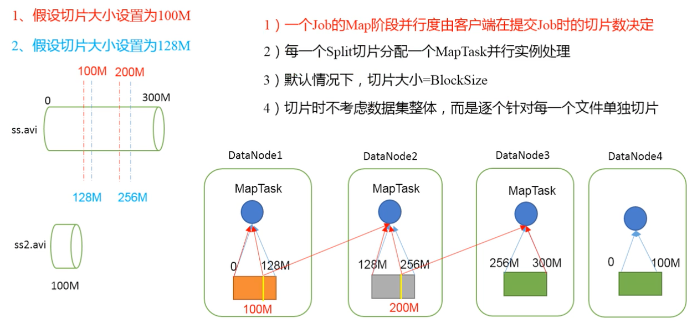
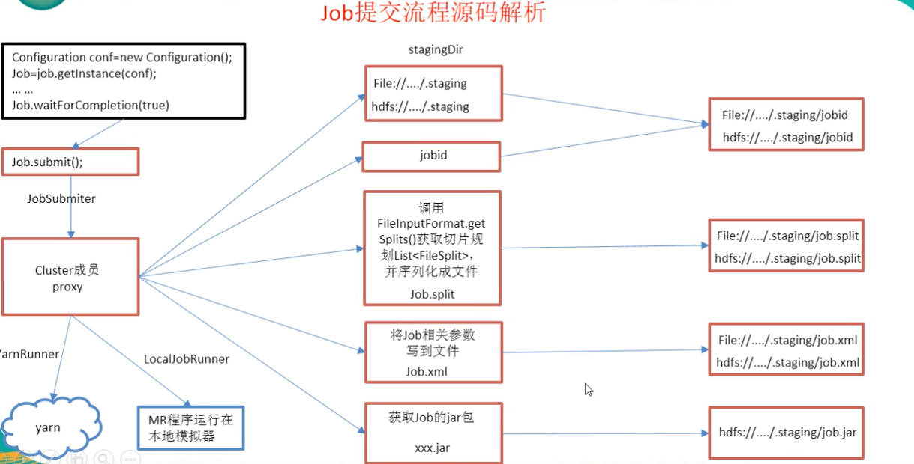

## MapReduce 概述
MapReduce是一个分布式运算程序的编程框架，是用户开发"基于Hadoop的数据分析应用"的核心框架
核心功能是将用户编写的业务逻辑代码和自带默认组件整合成一个完整的分布式运算程序，并发运行在一个Hadoop集群上。

### MapReduce 优缺点
优点 
1. 易于编程（简单的实现一些接口，就可以完成一个分布式程序）
2. 良好的扩展性（简单的增加机器）
3. 高容错性 （其中一台节点挂了，它可以把上面的计算任务转移到另外一台节点上运行，不至于这个任务运行失败 不需要人工参于）
4. 适合PB级别以上海量数据的离线处理，提供数据处理的能力

缺点
1. 不擅长实时计算
2. 不擅长流式计算 （输入的数据是静态的）
3. 不擅长DAG（有向图）计算 （每个MapReduce作业的输出结果都会写在磁盘上，会造成大量的磁盘IO，导致属性非常低下）
4. 

### MapReduce 的核心思想
1. MapReduce运算程序一般需要分成2个阶段： Map 阶段和Reduce 阶段
2. Map阶段的并发MapTask，完全并行运行，互不相干
3. Reduce阶段的并发ReduceTask，完全互不相干，但是他们的数据依赖于上一个阶段的所有MapTask并发实例的输出
4. MapReduce 编程模型只能包含一个Map阶段和一个Reduce阶段，如果逻辑复杂那就只能多个MapReduce程序串行运行

### MapReduce进程
一个完整的MapReduce程序在分布式运行时有三类实例进程：
MrAppMaster 负责整个程序的过程调度及状态协调
MapTask 负责Map阶段的整个数据处理流程
ReduceTask  负责Reduce阶段整个数据处理流程

### 常用数据序列化类型
Java 类型    Hadoop Writable类型
boolean        BooleanWritable
byte            ByteWritable
int             IntWritable
float           FloatWritable
long            LongWritable
double          DoubleWritable
String          Text
map             MapWritable
array           ArrayWritable

### MapReduce编程规范
Mapper 
    用户自定义 Mapper要继承的父类
    Mapper的输入数据是KV对的形式（KV的类型可自定义）
    Mapper中的业务逻辑写在map()方法中
    Mapper的输出数据是KV对的形式（KV的类型可自定义）
    map()方法（MapTask）对每个<K,V>调用一次
Reducer 
    用户自定义 的Reduce要继承自己的父类
    Reducer的输入数据类型对应Mapper的输出数据类型，也是KV 
    Reducer的业务逻辑写在reduce()方法中
    ReduceTask进程对每个相同的k的<k,v> 组调用一次reduce()方法
Driver
    相当于YARN集群的客户端，用于提交我们的整个程序到YARN集群，提交的是封装了MapReduce程序相关运行参数的job对象

### 在集群上运行 Wordcout 
将打好的jar包上传到服务器 运行如下
hadoop jar wc.jar com.huangg.mr.wordcount.WordCountDriver /user/hadoop/input /user/hadoop/wc_output

## Hadoop序列化
序列化 就是把内存中的对象，转换成字节序列（或其他数据传输协议）以便于存储到磁盘持久化 或 网络传输
反序列化 就是将收到的字节序列（或其他数据传输协议）或是磁盘的持久化化数据，转换成内存中的对象。

1. 为什么不使用Java的序列化？
Java的序列化是一个重量级序列化框架(Serializable),一个对象被序列化后，会附带很多额外的信息（各种校验信息，Header，继承体系等），不便于在网络中高效
传输，所以，Hadoop自己开发了一套序列化机制（Writable）

2. Hadoop序列化特点
紧凑： 高效使用存储空间
快速： 读写数据的额外开销小
可扩展： 随着通信协议的升级而可升级
互操作： 支持多语言的交互

3. 自定义 Bean对象实现序列化接口（Writable）
序列化与反序列化的顺序必须完全一致 ！！！
参考案例：flowStat 

## MapReduce框架原理 
### 数据输入
MapTask的并行度决定Map阶段的任务处理并发度，进而影响到整个Job的处理速度。
MapTask并行度决定机制
    数据块： Block是HDFS物理上把数据分成一块一块。
    数据切片：只是在逻辑上对输入进行分片，并不会在磁盘上将其切成片进行存储
1. 一个Job的Map阶段并行度由客户端在提交Job时的切片数决定
2. 每一个Split切片分配一个MapTask并行实例处理
3. 默认情况下，切片大小=BlockSize
4. 切片时不考虑数据集整体，而是逐个对每一个文件单独切片

### Job提交源码解析

### FileInputFormat切片源码解析
1. 程序先找到你数据存储的目录
2. 开始遍历处理（规划切片）目录下的每一个文件
3. 遍历第一个文件ss.txt
   1) 获取文件大小fs.sizeOf(ss.txt)
   2) 计算切片大小 Math.max(minSize,Math.min(maxSize,blocksize))
   3) 默认情况下，切片大小= blockSize
   4) 开始切，形成第1个切片：ss.txt -- 0:128M 第2个切片256M 第三个切片256-300M
      (每次切片时，fjtb要判断切完剩下的部分是否大于块的1.1倍，不大于1.12倍就划分一块切片)
   5) 将切片信息写到一个切片规划文件中
   6) 整个切片的核型过程在getSplit()方法中完成
   7) inputSplit只记录了切片的元数据信息，比如起始位置，长度及所在的节点列表等
4. 提交切片规划文件到YARN上，YARN上的MrAppMaster就可以根据切片规划文件计算开启MapTask个数

