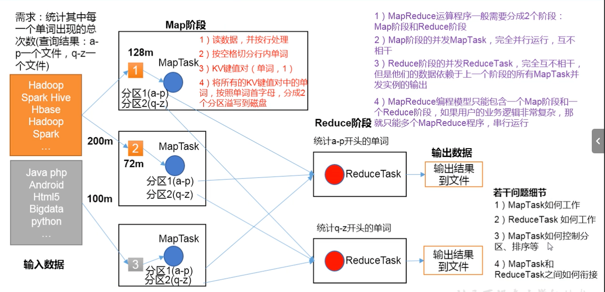

## MapReduce 概述
MapReduce是一个分布式运算程序的编程框架，是用户开发"基于Hadoop的数据分析应用"的核心框架
核心功能是将用户编写的业务逻辑代码和自带默认组件整合成一个完整的分布式运算程序，并发运行在一个Hadoop集群上。

### MapReduce 优缺点
优点 
1. 易于编程（简单的实现一些接口，就可以完成一个分布式程序）
2. 良好的扩展性（简单的增加机器）
3. 高容错性 （其中一台节点挂了，它可以把上面的计算任务转移到另外一台节点上运行，不至于这个任务运行失败 不需要人工参于）
4. 适合PB级别以上海量数据的离线处理，提供数据处理的能力

缺点
1. 不擅长实时计算
2. 不擅长流式计算 （输入的数据是静态的）
3. 不擅长DAG（有向图）计算 （每个MapReduce作业的输出结果都会写在磁盘上，会造成大量的磁盘IO，导致属性非常低下）
4. 

### MapReduce 的核心思想
1. MapReduce运算程序一般需要分成2个阶段： Map 阶段和Reduce 阶段
2. Map阶段的并发MapTask，完全并行运行，互不相干
3. Reduce阶段的并发ReduceTask，完全互不相干，但是他们的数据依赖于上一个阶段的所有MapTask并发实例的输出
4. MapReduce 编程模型只能包含一个Map阶段和一个Reduce阶段，如果逻辑复杂那就只能多个MapReduce程序串行运行

### MapReduce进程
一个完整的MapReduce程序在分布式运行时有三类实例进程：
MrAppMaster 负责整个程序的过程调度及状态协调
MapTask 负责Map阶段的整个数据处理流程
ReduceTask  负责Reduce阶段整个数据处理流程

